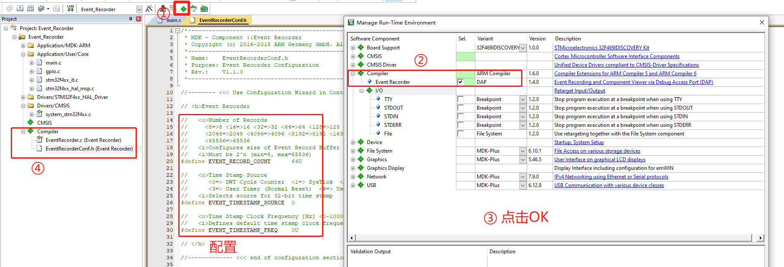
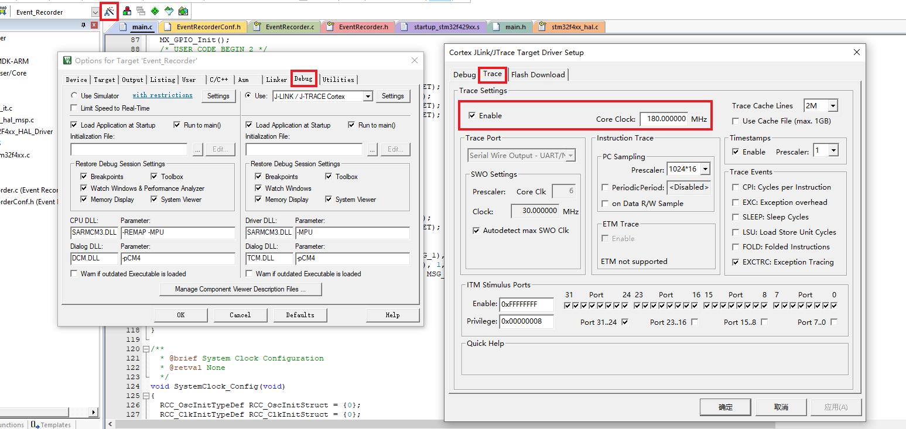
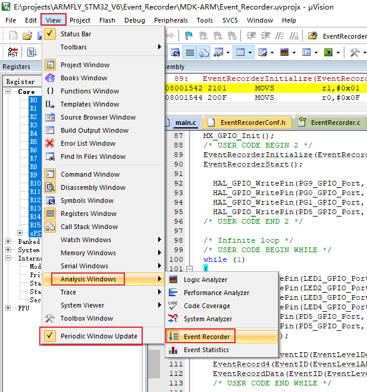
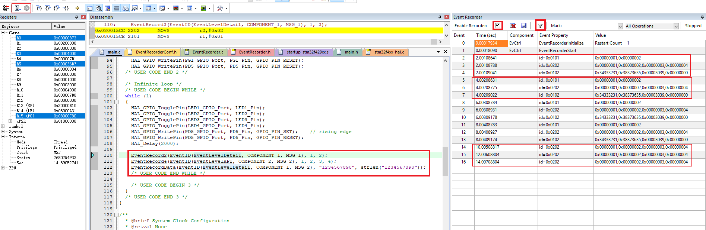
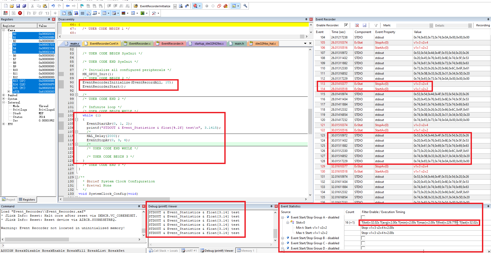

## 说明

### Event Record 数据输出

1. 本工程由 `../LED_blinky` 工程修改而来；
2. 首先在 `MDK` 中使能 `Event Recorder`(注意到下面有一个 `STDOUT`，这个是 `printf` 重定向用的，这里也可以选上，并将后面的 `Variant` 设置为 `EVR`。如果不需要通过 `Event Recorder` 输出日志，则不需要使能这个选项。如果选上了，下图中的④中会多一个 `retarget_io.c` 文件):

3. `Event Recorder` 的初始化：

```c
#include "EventRecorder.h"
#include "string.h"

// ...
EventRecorderInitialize(EventRecordAll, 1U);
EventRecorderStart();
```

4. 上面的初始化中，有一个 `EventRecordAll`，相应的，还有以下几个定义(通过以下定义可以知道，是设置`EventRecorder`的输出级别)：

```c
// Defines for parameter recording for Event Recorder Setup Functions
#define EventRecordNone         0x00U       ///< Record events is disabled
#define EventRecordError        0x01U       ///< Record events with level \ref EventLevelError
#define EventRecordAPI          0x02U       ///< Record events with level \ref EventLevelAPI
#define EventRecordOp           0x04U       ///< Record events with level \ref EventLevelOp
#define EventRecordDetail       0x08U       ///< Record events with level \ref EventLevelDetail
#define EventRecordAll          0x0FU       ///< Record events with any level
```

5. 然后调用以下接口使用 `EventRecorder` 输出数据：

```c
#define COMPONENT_1     (1)
#define COMPONENT_2     (2)

#define MSG_1           (1)
#define MSG_2           (2)

  EventRecorderInitialize(EventRecordAll, 1U);
  EventRecorderStart();
  
  while (1)
  {
    HAL_Delay(2000);

    EventRecord2(EventID(EventLevelDetail, COMPONENT_1, MSG_1), 1, 2);
    EventRecord4(EventID(EventLevelAPI, COMPONENT_2, MSG_2), 1, 2, 3, 4);
    EventRecordData(EventID(EventLevelDetail, COMPONENT_1, MSG_2), "1234567890", strlen("1234567890"));
  }
```
6. 在 `MDK` 中设置仿真时钟频率，编译并下载固件，进入调试模式，打开 `Event Recorder` 并全速运行程序：



通过输出结果可以看到，每隔 `2s` 就会输出三行记录，而是输出数据和程序中的一样。注意看最后三行，发现每 `2s` 只有一条记录了，那是因为我通过滤波器按钮，将 `EventLevelDetail` 级别的输出关闭了。其中每条记录的 `id` 都和我们上面设置的 `COMONENT` 和 `MSG` 相同。

### Event Record 通过重定向 `printf` 输出日志
1. 按上面的 `步骤2` 使能 `STDOUT` 重定向到 `EVR`；
2. 通过以下代码实现重定向功能：
```c
#include "EventRecorder.h"
#include "stdio.h"

    EventRecorderInitialize(EventRecordAll, 1U);
    EventRecorderStart();

    while(1) {
        EventStartAv(0, 1, 2);
        printf("STDOUT & Event_Statistics & float[%.2f] test\n", 3.1415);
        HAL_Delay(2000);
        EventStopAv(0, 3, 4);
    }
```
3. `STDOUT` 输出结果如下(通过 `View`-->`"Serial Windows"`-->`"Debug(printf) Viewer"` 使能日志输出窗口；还可以看到红色字体输出的 `Event Statistics` 输出)：

