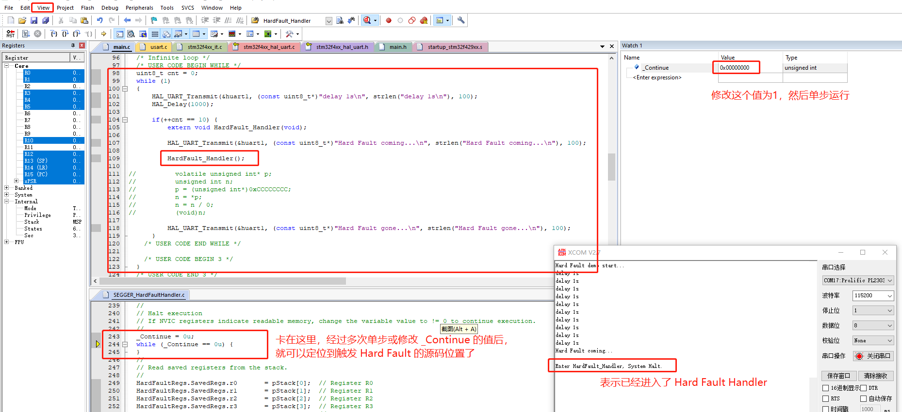

## 说明
1. 本例程基于 `../uart_recv_send` 例程；
2. 首先将 `HardFaultHandler.S` 和 `SEGGER_HardFaultHandler.c` 文件加入到工程；
3. 然后写一些会触发 `Hard Fault` 的错误代码，如下：
```c
  uint8_t cnt = 0;
  while (1)
  {
      HAL_UART_Transmit(&huart1, (const uint8_t*)"delay 1s\n", strlen("delay 1s\n"), 100);
      HAL_Delay(1000);
      
      if(++cnt == 10) {
          extern void HardFault_Handler(void);
          
          HAL_UART_Transmit(&huart1, (const uint8_t*)"Hard Fault coming...\n", strlen("Hard Fault coming...\n"), 100);
          
          HardFault_Handler();      // 直接调用可以进入
          
          // 通过以下明显错误的代码却不能进入 HardFault_Handler()，不明白为什么（优化等级已经改为 -O0 了）
          // volatile unsigned int* p;
          // unsigned int n;
          // p = (unsigned int*)0xCCCCCCCC;
          // n = *p;
          // n = n / 0;
          // (void)n;
          
          HAL_UART_Transmit(&huart1, (const uint8_t*)"Hard Fault gone...\n", strlen("Hard Fault gone...\n"), 100);
      }
  }
```
4. 然后编译工程，会发现编译出错，原因是在 `HardFaultHandler.S` 中重复定义了 `HardFault_Handler()` 函数，所以我们将 `stm32f4xx_it.c` 中默认的 `HardFault_Handler()` 函数删除，再次编译就可以了；
5. 程序正常工作 `10s` 后，将会进入 `HardFault_Handler()`，而这个新实现的 `HardFault_Handler()` 函数又会调用 `void HardFaultHandler(unsigned int* pStack)` 函数，这里多了一个 `pStack` 参数，而这个参数正是 `Hard Fault` 调试功能能够完成的重点！
6. 这个功能需要进入调试模式才能完成，而且在进入 `void HardFaultHandler(unsigned int* pStack)` 函数后，有两个地方会陷入无限循环，通过 `View-->"Watch Windows"` 打开局部变量窗口，修改 `_Continue` 变量的值，然后单步运行，即可跳转到出现 `Hard Fault` 的源代码处了，如下图：
