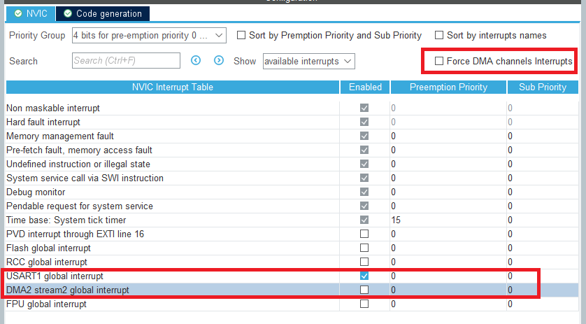

## 说明
1. 这个例程通过 `USART1` 的串口空闲 `DMA` 中断的方式，实现不定长串口数据的接收；
2. 先在 `CubeMx` 中配置 `USART1`，并使能中断和相应的 `DMA` 通道；这里的 `DMA` 中断可以关闭，只开串口中断就可以了：

3. 配置并生成代码后，需要先通过 `HAL_StatusTypeDef HAL_UARTEx_ReceiveToIdle_DMA(UART_HandleTypeDef *huart, uint8_t *pData, uint16_t Size)` 函数设置 `DMA` 接收数据后存储的 `buf(pData)` 及 `buf_size(Size)`；还需要重写 `void HAL_UARTEx_RxEventCallback(UART_HandleTypeDef *huart, uint16_t Size)` 这个函数，用于处理接收完的数据，其中的 `Size` 参数表示实际接收的长度；
4. 注意：每次进入 `HAL_UARTEx_RxEventCallback()` 函数后，都需要重新调用 `HAL_UARTEx_ReceiveToIdle_DMA()` 函数设置接收缓存，代码如下：
```c
extern uint8_t rxBuf[LEN_UART1_RX_BUF];
void HAL_UARTEx_RxEventCallback(UART_HandleTypeDef *huart, uint16_t Size)
{
    if(huart == &huart1) {
        HAL_UART_Transmit(&huart1, rxBuf, Size, 100);
        HAL_UARTEx_ReceiveToIdle_DMA(&huart1, rxBuf, LEN_UART1_RX_BUF);
    }
}
```